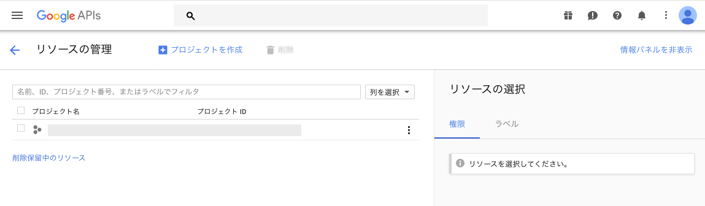

# Gmail API 呼び出しのためのセットアップ

## 参考
https://developers.google.com/gmail/api/quickstart/python

## Google Cloud Console の設定

### プロジェクトの作成
以下のWebコンソールを立ち上げる。      
https://console.developers.google.com/cloud-resource-manager

以下を参照し、プロジェクトを作成し、認証情報を設定する。
認証情報はOAuth同意画面で設定をする。

### pythonプログラムからAPIの呼び出し
認証情報 > OAuth 2.0 クライアント ID からJSONをダウンロード

https://developers.google.com/gmail/api/quickstart/python
を参照し、JSONをclient_secret.jsonとして、保存。